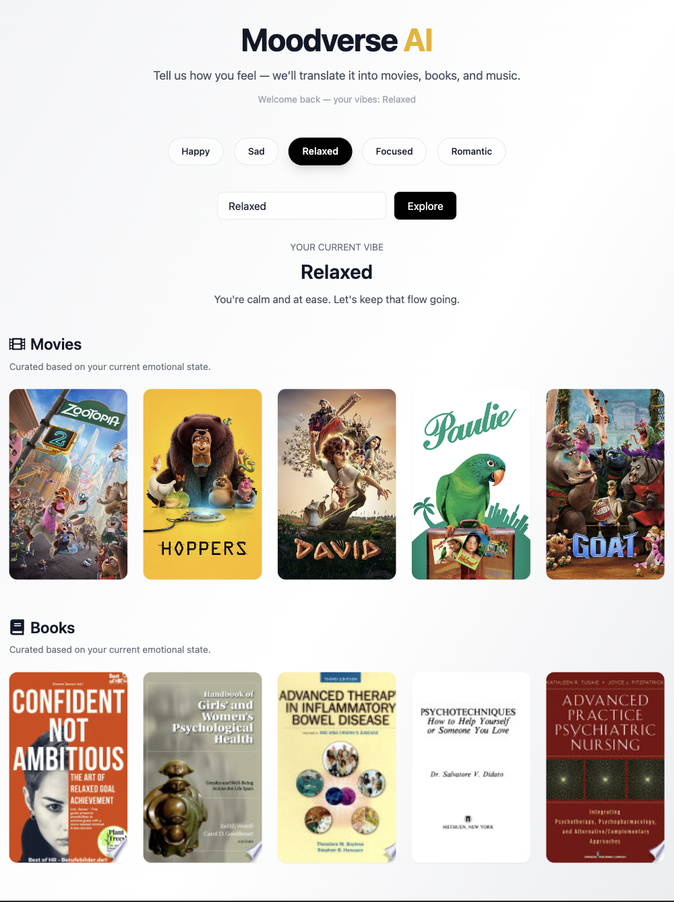
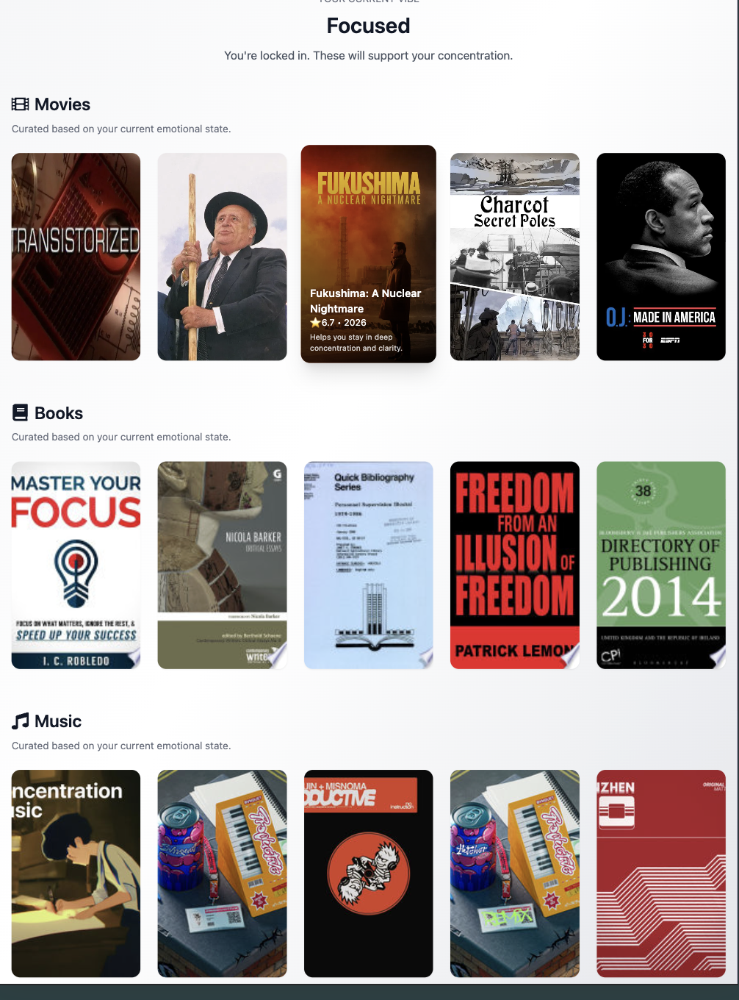

# 🎧 Moodverse AI

AI-powered web application that generates personalized movie, book, and music recommendations based on your mood.

## 🚀 Live Demo
https://moodverseai.netlify.app/

## 🧠 Description
Moodverse allows users to select or type a mood and instantly receive curated recommendations across multiple categories.

The app integrates external APIs and uses a custom backend to process mood-based queries and return dynamic results.

---

## ✨ Features
- 🎭 Mood-based recommendations
- 🎬 Movies, 📚 Books, 🎵 Music in one place
- ⚡ Real-time API data fetching
- 🎧 Music preview playback
- 🧠 AI-style recommendation logic
- 💡 Clean and responsive UI

---

## 🛠 Tech Stack
Frontend:
- React (Vite)
- Tailwind CSS
- JavaScript (ES6+)

Backend:
- Node.js / Express (or your backend setup)
- External APIs (movies, books, music)

## ⚙️ Environment Variables
Create a `.env` file in the frontend:

VITE_API_URL=your_backend_url

---

## 📦 Installation

## bash
git clone https://github.com/Y8724/moodverse.git
cd moodverse/frontend/moodverse-frontend
npm install
npm run dev

---

## 📂 Project Structure

frontend/
  moodverse-frontend/
    src/
    components/
backend/
  server/
  
---

## 📸 Screenshots

### Moodverse (Relaxed)

### Moodverse (Focused)

---

## ⚙️ Environment Setup

# Clone the Repository
- git clone https://github.com/your-username/moodverse.git
- cd moodverse

# Backend Setup
- cd backend
- npm install

- Create .env file:
- cp .env.example .env

# Fill in your API keys:
- PORT=5050
- TMDB_API_KEY=your_key
- GOOGLE_BOOKS_KEY=your_key
- DEEZER_KEY=your_key

# Start backend:
- npm start

# Backend runs on:
- http://localhost:5050

---

# Frontend Setup

- cd frontend
- npm install

- Create .env file:

- cp .env.example .env

---

# Add backend URL:

- VITE_API_URL=http://localhost:5050

# Start frontend:

- npm run dev

# Frontend runs on:

- http://localhost:5173

---

## 🧠 What I Learned

- Integrating multiple external APIs

- Managing async data fetching

- Secure API key handling

- Full-stack project architecture

- UX/UI improvements

- Audio playback handling in React

---

🔮 Future Improvements

- Save favorite recommendations
- User authentication
- Improved AI recommendation logic
- Better loading and error states

👨‍💻 Author
Yanay Sánchez

## 📄 License

- This project is licensed under the MIT License.

---

## ❤️ Acknowledgments

- TMDB API

- Google Books API

- Deezer API

- Open-source community
